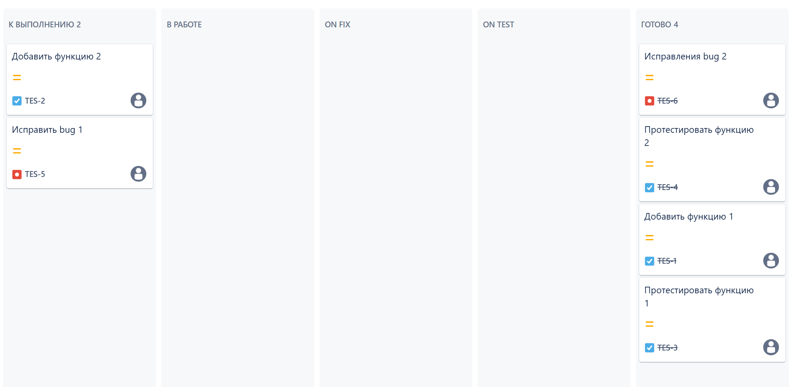
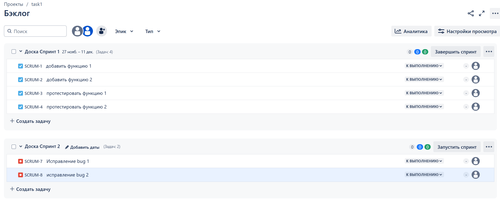
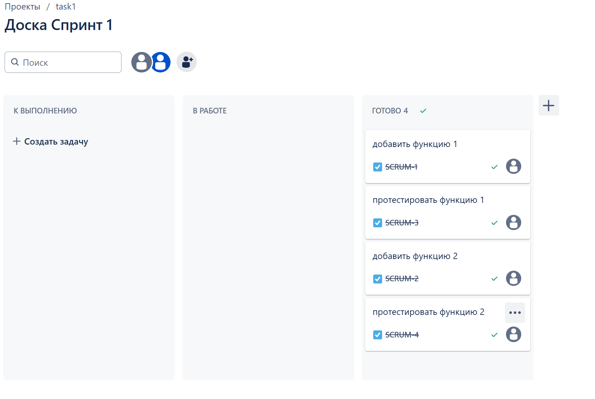
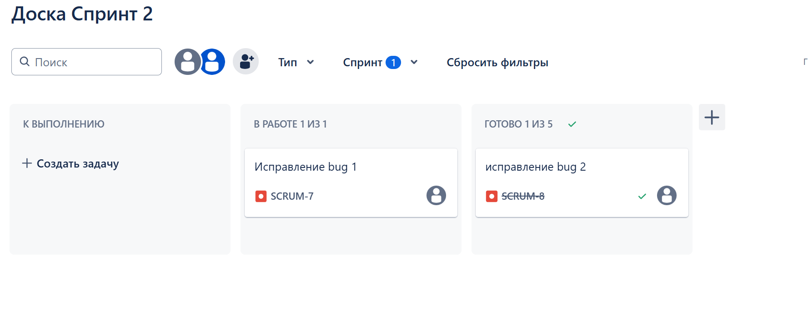

# ЖИЗНЕННЫЙ ЦИКЛ ПО

Создано 2 проекта на платформе atlassian.net: [ссылка]([https://djira.atlassian.net/jira/software/projects/SC/boards/1](https://martishinid.atlassian.net/jira/software/c/projects/TES/boards/2))

## Доска Kanban

В проекте созданы 4 задачи типа `task`:
- добавить функцию 1
- добавить функцию 2
- протестировать функцию 1
- протестировать функцию 2

Дополнительно созданы 2 задачи типа `bug`:
- иcправление bug 1
- иcправление bug 2

Задачи переносились между столбцами со стасусами:
- Open -> On reproduce.
- On reproduce -> Open, Done reproduce.
- Done reproduce -> On fix.
- On fix -> On reproduce, Done fix.
- Done fix -> On test.
- On test -> On fix, Done.
- Done -> Closed, Open.

## Доска Scrum

Перечень задач аналогичен предыдущему проекту

Создано 2 спринта
1. __Спринт 1__
- добавить функцию 1
- добавить функцию 2
- протестировать функцию 1
- протестировать функцию 2

2. __Спринт 2__
- иcправление bug 1
- иcправление bug 2

В рамках спринтов было движение задач
`Open -> In progress -> Done -> In progress -> Done`

# Задание
[https://github.com/netology-code/mnt-homeworks/blob/MNT-video/09-ci-01-intro/README.md](https://github.com/netology-code/mnt-homeworks/blob/MNT-video/09-ci-01-intro/README.md)
